# Model Context Protocol: Advanced Topics — Anthropic Course Notes

## Table of Contents

1. [Sampling](#sampling)
2. [Logging and Progress Notifications](#logging-and-progress-notifications)
3. [Roots](#roots)
4. [JSON Message Types](#json-message-types)
5. [The STDIO Transport](#the-stdio-transport)
6. [The StreamableHTTP Transport](#the-streamablehttp-transport)
7. [StreamableHTTP In Depth](#streamablehttp-in-depth)
8. [State and the StreamableHTTP Transport](#state-and-the-streamablehttp-transport)
9. [Complete Code Reference](#complete-code-reference)

---

## Sampling

Sampling allows a server to access a language model like Claude through a connected MCP client. Instead of the server directly calling Claude, it asks the client to make the call on its behalf. This shifts the responsibility and cost of text generation from the server to the client.

### The Problem Sampling Solves

Imagine you have an MCP server with a research tool that fetches information from Wikipedia. After gathering all that data, you need to summarize it into a coherent report. You have two options:

| Option | Approach | Trade-off |
|---|---|---|
| **Direct API access** | Give the MCP server its own API key, handle auth, manage costs | Adds significant complexity to the server |
| **Sampling** | Server creates a prompt, asks the client to call Claude on its behalf | Server stays simple; client bears cost and auth |

**Option 1 — Direct API Access:** The server would need its own API key, handle authentication, manage costs, and implement all the Claude integration code. This works but adds significant complexity.

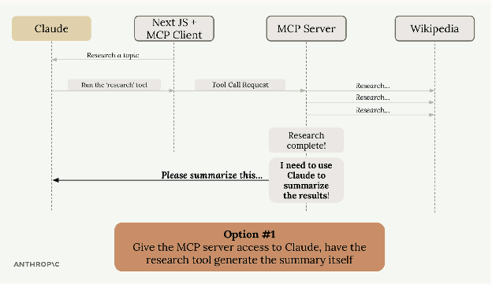

**Option 2 — Sampling:** The server generates a prompt and asks the client "Could you call Claude for me?" The client, which already has a connection to Claude, makes the call and returns the results.

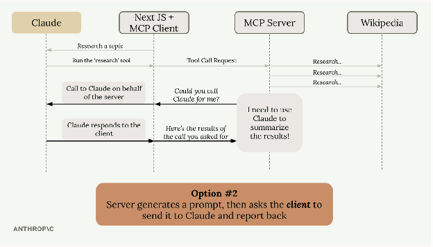

### How Sampling Works

```
Server completes its work (e.g., fetching Wikipedia articles)
         ↓
Server creates a prompt asking for text generation
         ↓
Server sends a sampling request to the client
         ↓
Client calls Claude with the provided prompt
         ↓
Client returns the generated text to the server
         ↓
Server uses the generated text in its response
```

### Benefits

- **Reduces server complexity** — The server doesn't need to integrate with language models directly
- **Shifts cost burden** — The client pays for token usage, not the server
- **No API keys needed** — The server doesn't need credentials for Claude
- **Perfect for public servers** — You don't want a public server racking up AI costs for every user

### Server-Side Implementation

```python
from mcp.server.fastmcp import FastMCP, Context
from mcp.types import SamplingMessage, TextContent

mcp = FastMCP(name="Demo Server")


@mcp.tool()
async def summarize(text_to_summarize: str, ctx: Context):
    prompt = f"""
        Please summarize the following text:
        {text_to_summarize}
    """

    result = await ctx.session.create_message(
        messages=[
            SamplingMessage(
                role="user", content=TextContent(type="text", text=prompt)
            )
        ],
        max_tokens=4000,
        system_prompt="You are a helpful research assistant.",
    )

    if result.content.type == "text":
        return result.content.text
    else:
        raise ValueError("Sampling failed")


if __name__ == "__main__":
    mcp.run(transport="stdio")
```

Key elements:
- `ctx.session.create_message()` — Sends the sampling request to the client
- `SamplingMessage` — Wraps the prompt content with a role (`user` or `assistant`)
- `max_tokens` — Limits the response length
- `system_prompt` — Optional system instruction for the LLM call

### Client-Side Implementation

```python
from anthropic import AsyncAnthropic
from mcp import ClientSession, StdioServerParameters
from mcp.client.stdio import stdio_client
from mcp.client.session import RequestContext
from mcp.types import (
    CreateMessageRequestParams,
    CreateMessageResult,
    TextContent,
    SamplingMessage,
)

anthropic_client = AsyncAnthropic()
model = "claude-sonnet-4-0"


async def chat(input_messages: list[SamplingMessage], max_tokens=4000):
    """Convert SamplingMessages to Anthropic SDK format and call Claude."""
    messages = []
    for msg in input_messages:
        if msg.role == "user" and msg.content.type == "text":
            messages.append({"role": "user", "content": msg.content.text})
        elif msg.role == "assistant" and msg.content.type == "text":
            messages.append({"role": "assistant", "content": msg.content.text})

    response = await anthropic_client.messages.create(
        model=model,
        messages=messages,
        max_tokens=max_tokens,
    )
    return "".join([p.text for p in response.content if p.type == "text"])


async def sampling_callback(
    context: RequestContext, params: CreateMessageRequestParams
):
    """Callback that handles the server's sampling requests."""
    text = await chat(params.messages)
    return CreateMessageResult(
        role="assistant",
        model=model,
        content=TextContent(type="text", text=text),
    )


async def run():
    async with stdio_client(server_params) as (read, write):
        async with ClientSession(
            read, write, sampling_callback=sampling_callback
        ) as session:
            await session.initialize()

            result = await session.call_tool(
                name="summarize",
                arguments={"text_to_summarize": "lots of text"},
            )
            print(result.content)
```

Key elements:
- `sampling_callback` — Handles incoming sampling requests from the server
- `chat()` — Converts `SamplingMessage` objects to the Anthropic SDK format and calls Claude
- `sampling_callback=sampling_callback` — Passed to `ClientSession` during initialization

### Sampling Walkthrough

Here's the step-by-step flow of how sampling works in practice:

**Step 1 — Initiate sampling on the server:** During a tool call, run the `create_message()` method, passing in messages you wish to send to a language model.

```python
# server.py
result = await ctx.session.create_message(
    messages=[
        SamplingMessage(
            role="user", content=TextContent(type="text", text=prompt)
        )
    ],
    max_tokens=4000,
    system_prompt="You are a helpful research assistant.",
)
```

**Step 2 — Implement a sampling callback on the client:** The callback receives a list of messages provided by the server.

```python
# client.py
async def sampling_callback(
    context: RequestContext, params: CreateMessageRequestParams
):
```

**Step 3 — Handle message format conversion:** The messages provided by the server are formatted for MCP communication. They aren't guaranteed to be compatible with whatever LLM SDK you're using. For example, if you're using the Anthropic SDK, you'll need to write conversion logic to turn MCP messages into a format compatible with Anthropic's SDK.

```python
# client.py
for msg in input_messages:
    if msg.role == "user" and msg.content.type == "text":
        content = (
            msg.content.text
            if hasattr(msg.content, "text")
            else str(msg.content)
        )
        messages.append({"role": "user", "content": content})
    elif msg.role == "assistant" and msg.content.type == "text":
        content = (
            msg.content.text
            if hasattr(msg.content, "text")
            else str(msg.content)
        )
        messages.append({"role": "assistant", "content": content})
```

**Step 4 — Return generated text:** After generating text with the LLM, return a `CreateMessageResult` containing the generated text.

```python
# client.py
text = await chat(params.messages)

return CreateMessageResult(
    role="assistant",
    model=model,
    content=TextContent(type="text", text=text),
)
```

**Step 5 — Connect the callback:** Pass the callback into the `ClientSession` call.

```python
# client.py
ClientSession(
    read, write,
    sampling_callback=sampling_callback
)
```

**Step 6 — Use the result on the server:** After the client has generated and returned text, it will be sent back to the server. You can then:
- Use it as part of a workflow in your tool
- Decide to make another sampling call
- Return the generated text directly

### When to Use Sampling

Sampling is most valuable when building **publicly accessible MCP servers**. You don't want random users generating unlimited text at your expense. By using sampling, each client pays for their own AI usage while still benefiting from your server's functionality. The technique essentially moves the AI integration complexity from your server to the client, which often already has the necessary connections and credentials in place.

---

## Logging and Progress Notifications

Logging and progress notifications are simple to implement but make a huge difference in user experience when working with MCP servers. They help users understand what's happening during long-running operations instead of wondering if something has broken.

When Claude calls a tool that takes time to complete — like researching a topic or processing data — users typically see nothing until the operation finishes. This can be frustrating because they don't know if the tool is working or has stalled. With logging and progress notifications enabled, users get real-time feedback showing exactly what's happening behind the scenes.

### How It Works

In the Python MCP SDK, logging and progress notifications work through the `Context` argument that's automatically provided to your tool functions. This context object gives you methods to communicate back to the client during execution.

```python
@mcp.tool(
    name="research",
    description="Research a given topic"
)
async def research(
    topic: str = Field(description="Topic to research"),
    *,
    context: Context
):
    await context.info("About to do research...")
    await context.report_progress(20, 100)
    sources = await do_research(topic)

    await context.info("Writing report...")
    await context.report_progress(70, 100)
    results = await generate_report(sources)

    return results
```

### Server-Side Implementation

```python
from mcp.server.fastmcp import FastMCP, Context
import asyncio

mcp = FastMCP(name="Demo Server")


@mcp.tool()
async def add(a: int, b: int, ctx: Context) -> int:
    await ctx.info("Preparing to add...")
    await ctx.report_progress(20, 100)

    await asyncio.sleep(2)

    await ctx.info("OK, adding...")
    await ctx.report_progress(80, 100)

    return a + b


if __name__ == "__main__":
    mcp.run(transport="stdio")
```

Key methods:
| Method | Purpose |
|---|---|
| `ctx.info()` | Send informational log messages to the client |
| `ctx.warning()` | Send warning log messages |
| `ctx.debug()` | Send debug log messages |
| `ctx.error()` | Send error log messages |
| `ctx.report_progress(current, total)` | Update progress with current and total values |

### Client-Side Implementation

```python
from mcp import ClientSession, StdioServerParameters
from mcp.client.stdio import stdio_client
from mcp.types import LoggingMessageNotificationParams

server_params = StdioServerParameters(
    command="uv",
    args=["run", "server.py"],
)


async def logging_callback(params: LoggingMessageNotificationParams):
    print(params.data)


async def print_progress_callback(
    progress: float, total: float | None, message: str | None
):
    if total is not None:
        percentage = (progress / total) * 100
        print(f"Progress: {progress}/{total} ({percentage:.1f}%)")
    else:
        print(f"Progress: {progress}")


async def run():
    async with stdio_client(server_params) as (read, write):
        async with ClientSession(
            read, write, logging_callback=logging_callback
        ) as session:
            await session.initialize()

            await session.call_tool(
                name="add",
                arguments={"a": 1, "b": 3},
                progress_callback=print_progress_callback,
            )
```

Key points:
- `logging_callback` — Provided when creating the `ClientSession` (handles all log messages)
- `progress_callback` — Provided per tool call via `call_tool(progress_callback=...)`
- Both callbacks are optional — you choose what to handle

### Notifications Walkthrough

**Step 1 — Tool function receives context argument:** Tool functions automatically receive `Context` as their last argument. This object has methods for logging and reporting progress to the client.

```python
# server.py
async def add(a: int, b: int, ctx: Context) -> int:
```

**Step 2 — Create logs and progress with context:** Throughout your tool function, call the `info()`, `warning()`, `debug()`, or `error()` methods to log different types of messages for the client. Also call `report_progress()` to estimate the amount of remaining work.

```python
# server.py
await ctx.info("Preparing to add...")
await ctx.report_progress(20, 100)

await asyncio.sleep(2)

await ctx.info("OK, adding...")
await ctx.report_progress(80, 100)
```

**Step 3 — Define callbacks on the client:** The client needs to define logging and progress callbacks, which will automatically be called whenever the server emits log or progress messages. These callbacks should display the provided data to the user.

```python
# client.py
async def logging_callback(params: LoggingMessageNotificationParams):
    print(params.data)

async def print_progress_callback(
    progress: float, total: float | None, message: str | None
):
    if total is not None:
        percentage = (progress / total) * 100
        print(f"Progress: {progress}/{total} ({percentage:.1f}%)")
    else:
        print(f"Progress: {progress}")
```

**Step 4 — Pass callbacks to appropriate functions:** Provide the logging callback to the `ClientSession` and the progress callback to the `call_tool()` function.

```python
# client.py
async with ClientSession(
    read, write, logging_callback=logging_callback
) as session:
    await session.initialize()

    await session.call_tool(
        name="add",
        arguments={"a": 1, "b": 3},
        progress_callback=print_progress_callback,
    )
```

### Presentation Options

How you present these notifications depends on your application type:

| Application Type | Presentation |
|---|---|
| CLI | Print messages and progress to terminal |
| Web | WebSockets, server-sent events, or polling |
| Desktop | Update progress bars and status displays in UI |

Remember that implementing these notifications is entirely optional. You can choose to ignore them completely, show only certain types, or present them however makes sense for your application. They're purely user experience enhancements to help users understand what's happening during long-running operations.

---

## Roots

Roots grant MCP servers access to specific files and folders on your local machine. They act as a permission system that says "Hey, MCP server, you can access these files" — but they do much more than just grant permission.

### The Problem Roots Solve

Without roots, you'd run into a common issue. Imagine you have an MCP server with a video conversion tool that takes a file path and converts an MP4 to MOV format.

When a user asks Claude to "convert biking.mp4 to mov format", Claude would call the tool with just the filename. But here's the problem — Claude has no way to search through your entire file system to find where that file actually lives.

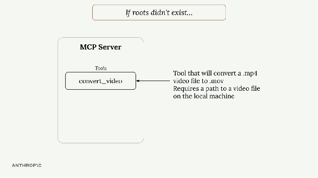

Your file system might be complex with files scattered across different directories. The user knows the biking.mp4 file is in their Movies folder, but Claude doesn't have that context. You could solve this by requiring users to always provide full paths, but that's not very user-friendly.

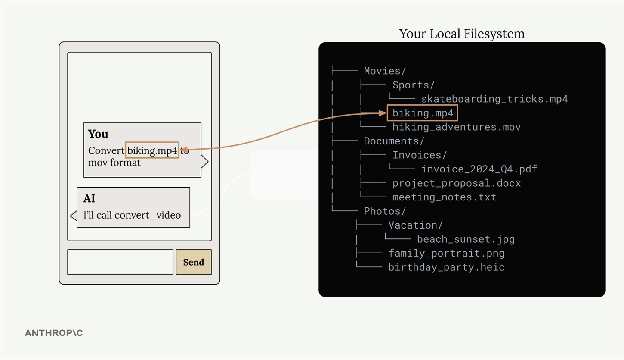

### Roots in Action

Here's how the workflow changes with roots:

```
User asks to convert a video file
         ↓
Claude calls list_roots to see accessible directories
         ↓
Claude calls read_dir on accessible directories to find the file
         ↓
Once found, Claude calls the conversion tool with the full path
```

This happens automatically — users can still just say "convert biking.mp4" without providing full paths.

### Security and Boundaries

Roots provide security by **limiting access**. If you only grant access to your Desktop folder, the MCP server cannot access files in Documents or Downloads. When Claude tries to access a file outside the approved roots, it gets an error and can inform the user that the file isn't accessible from the current server configuration.

### Implementation Details

The MCP SDK does **not** automatically enforce root restrictions — you need to implement this yourself. A typical pattern is to create a helper function like `is_path_allowed()` that:
1. Takes a requested file path
2. Gets the list of approved roots from the client
3. Checks if the requested path falls within one of those roots
4. Returns `True`/`False` for access permission

You then call this function in any tool that accesses files or directories **before** performing the actual file operation.

### Server-Side Implementation

```python
from pathlib import Path
from mcp.server.fastmcp import FastMCP, Context
from pydantic import Field

mcp = FastMCP("VidsMCP", log_level="ERROR")


async def is_path_allowed(requested_path: Path, ctx: Context) -> bool:
    """Check if a requested path falls within one of the approved roots."""
    roots_result = await ctx.session.list_roots()
    client_roots = roots_result.roots

    if not requested_path.exists():
        return False

    if requested_path.is_file():
        requested_path = requested_path.parent

    for root in client_roots:
        root_path = file_url_to_path(root.uri)
        try:
            requested_path.relative_to(root_path)
            return True
        except ValueError:
            continue

    return False


@mcp.tool()
async def convert_video(
    input_path: str = Field(description="Path to the input MP4 file"),
    format: str = Field(description="Output format (e.g. 'mov')"),
    *,
    ctx: Context,
):
    """Convert an MP4 video file to another format using ffmpeg"""
    input_file = VideoConverter.validate_input(input_path)

    if not await is_path_allowed(input_file, ctx):
        raise ValueError(f"Access to path is not allowed: {input_path}")

    return await VideoConverter.convert(input_path, format)


@mcp.tool()
async def list_roots(ctx: Context):
    """List all directories accessible to this server."""
    roots_result = await ctx.session.list_roots()
    return [file_url_to_path(root.uri) for root in roots_result.roots]


@mcp.tool()
async def read_dir(
    path: str = Field(description="Path to a directory to read"),
    *,
    ctx: Context,
):
    """Read directory contents. Path must be within one of the client's roots."""
    requested_path = Path(path).resolve()

    if not await is_path_allowed(requested_path, ctx):
        raise ValueError("Error: can only read directories within a root")

    return [entry.name for entry in requested_path.iterdir()]
```

Key patterns:
- `ctx.session.list_roots()` — Server asks the client what roots are available
- `is_path_allowed()` — Helper that checks if a path falls within an approved root using `relative_to()`
- All file-accessing tools should call `is_path_allowed()` before performing operations

### Client-Side Implementation

```python
from mcp.types import Root, ListRootsResult, ErrorData
from mcp.shared.context import RequestContext
from pydantic import FileUrl


class MCPClient:
    def __init__(self, command, args, env=None, roots=None):
        self._roots = self._create_roots(roots) if roots else []

    def _create_roots(self, root_paths: list[str]) -> list[Root]:
        """Convert path strings to Root objects."""
        roots = []
        for path in root_paths:
            p = Path(path).resolve()
            file_url = FileUrl(f"file://{p}")
            roots.append(Root(uri=file_url, name=p.name or "Root"))
        return roots

    async def _handle_list_roots(
        self, context: RequestContext["ClientSession", None]
    ) -> ListRootsResult | ErrorData:
        """Callback for when server requests roots."""
        return ListRootsResult(roots=self._roots)

    async def connect(self):
        # ...
        self._session = await self._exit_stack.enter_async_context(
            ClientSession(
                _stdio,
                _write,
                list_roots_callback=self._handle_list_roots
                if self._roots
                else None,
            )
        )
```

Key elements:
- `_create_roots()` — Converts file path strings to `Root` objects with `file://` URIs
- `_handle_list_roots()` — Callback the server calls to discover available roots
- `list_roots_callback` — Passed to `ClientSession` during initialization
- Roots are provided as command-line arguments: `uv run main.py /path/to/videos`

### Roots Walkthrough

**Step 1 — Defining roots:** Ideally, a user will dictate which files/folders can be accessed by the MCP server. This program accepts CLI arguments interpreted as paths the user wants to allow access to.

```python
# main.py
root_paths = sys.argv[1:]
```

**Step 2 — Creating root objects:** According to the MCP spec, all roots should have a URI that begins with `file://`. This function converts user-provided paths into `Root` objects.

```python
# mcp_client.py
def _create_roots(self, root_paths: list[str]) -> list[Root]:
    """Convert path strings to Root objects."""
    roots = []
    for path in root_paths:
        p = Path(path).resolve()
        file_url = FileUrl(f"file://{p}")
        roots.append(Root(uri=file_url, name=p.name or "Root"))
    return roots
```

**Step 3 — Roots callback:** The client doesn't immediately provide the list of roots to the server. Instead, the server can make a request to the client at some future point. The callback returns the list of roots inside a `ListRootsResult` object.

```python
# mcp_client.py
async def _handle_list_roots(
    self, context: RequestContext["ClientSession", None]
) -> ListRootsResult | ErrorData:
    """Callback for when server requests roots."""
    return ListRootsResult(roots=self._roots)
```

**Step 4 — Using the roots on the server:** The server uses roots in two scenarios:
1. Whenever a tool attempts to access a file or folder
2. When an LLM (like Claude) needs to resolve a file or folder to a full path (e.g., when a user says "read the todos.txt file" — Claude needs to figure out where it is by looking at the list of roots)

```python
@mcp.tool()
async def list_roots(ctx: Context):
    """List all directories accessible to this server."""
    roots_result = await ctx.session.list_roots()
    client_roots = roots_result.roots
    return [file_url_to_path(root.uri) for root in client_roots]
```

**Step 5 — Accessing the roots:** Roots are accessed by calling `ctx.session.list_roots()`. This sends a message back to the client, which causes it to run the root-listing callback.

```python
# mcp_server.py
roots_result = await ctx.session.list_roots()
```

**Step 6 — Authorizing access:** Remember: the MCP SDK does **not** attempt to limit what files or folders your tools attempt to read. You must implement that check yourself. Consider implementing a function like `is_path_allowed` that compares the requested path against the list of roots.

```python
# mcp_server.py
if not await is_path_allowed(input_file, ctx):
    raise ValueError(f"Access to path is not allowed: {input_path}")
```

### Key Benefits

- **User-friendly** — Users don't need to provide full file paths
- **Focused search** — Claude only looks in approved directories, making file discovery faster
- **Security** — Prevents accidental access to sensitive files outside approved areas
- **Flexibility** — Roots can be provided through tools or injected directly into prompts

Roots make MCP servers both more powerful and more secure by giving Claude the context it needs to find files while maintaining clear boundaries around what it can access.

---

## JSON Message Types

MCP uses JSON messages to handle communication between clients and servers. Understanding these message types is crucial, especially when working with different transport methods like the streamable HTTP transport.

### Message Format

All MCP communication happens through JSON messages. Each message type serves a specific purpose — whether it's calling a tool, listing available resources, or sending notifications about system events.

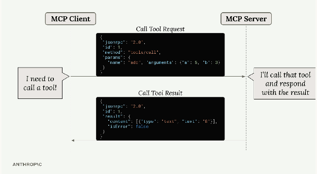

Here's a typical example: when Claude needs to call a tool provided by an MCP server, the client sends a **Call Tool Request** message. The server processes this request, runs the tool, and responds with a **Call Tool Result** message containing the output.

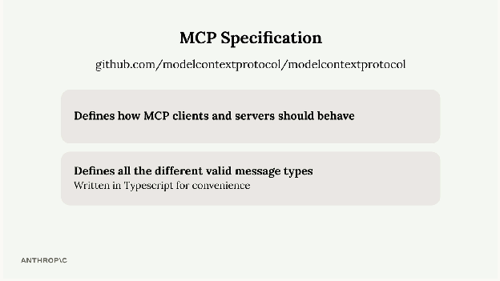

### MCP Specification

The complete list of message types is defined in the official **MCP specification repository on GitHub**. This specification is separate from the various SDK repositories (like Python or TypeScript SDKs) and serves as the authoritative source for how MCP should work. The message types are written in TypeScript for convenience — not because they're executed as TypeScript code, but because TypeScript provides a clear way to describe data structures and types.

### Message Categories

MCP messages fall into two main categories:

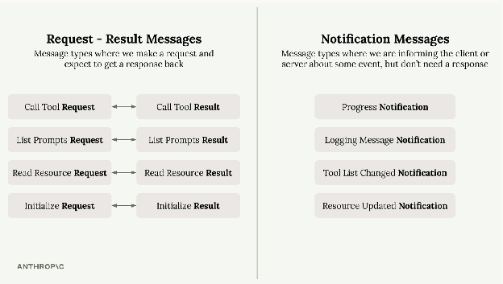

#### Request-Result Messages (paired)

These messages always come in pairs. You send a request and expect to get a result back:

| Request | Result | Purpose |
|---|---|---|
| Initialize Request | Initialize Result | Start a connection |
| Call Tool Request | Call Tool Result | Execute a tool |
| List Prompts Request | List Prompts Result | Discover prompts |
| Read Resource Request | Read Resource Result | Fetch resource data |

#### Notification Messages (one-way, no response expected)

These are one-way messages that inform about events but don't require a response:

| Notification | Purpose |
|---|---|
| Progress Notification | Update on long-running operations |
| Logging Message Notification | System log messages |
| Tool List Changed Notification | Available tools changed |
| Resource Updated Notification | Resource was modified |
| Initialized Notification | Client confirms initialization |

### Client vs Server Messages

The MCP specification organizes messages by who sends them:

- **Client messages** — Requests clients send to servers (like tool calls) and notifications clients might send
- **Server messages** — Requests servers send to clients (like sampling) and notifications servers broadcast

**Key insight:** MCP is designed as a **bidirectional protocol** — both clients and servers can initiate communication. This becomes crucial when choosing the right transport method.

### Why This Matters

Understanding that servers can send messages to clients is particularly important when working with different transport methods. Some transports, like the streamable HTTP transport, have limitations on which types of messages can flow in which directions. The key insight is that MCP is designed as a bidirectional protocol — both clients and servers can initiate communication. This becomes crucial when you need to choose the right transport method for your specific use case.

---

## The STDIO Transport

MCP clients and servers communicate by exchanging JSON messages, but how do these messages actually get transmitted? The communication channel used is called a **transport**, and there are several ways to implement this — from HTTP requests to WebSockets to even writing JSON on a postcard (though that last one isn't recommended for production use).

### How It Works

The stdio transport is the most commonly used transport for development. The client launches the MCP server as a subprocess and communicates through standard input and output streams.

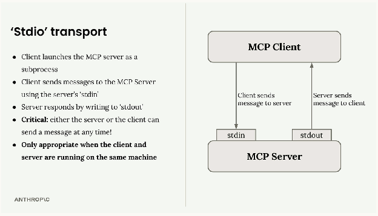

```
Client  ──stdin──→  Server
Client  ←──stdout──  Server
```

- Client sends messages to the server using the server's **stdin**
- Server responds by writing to **stdout**
- Either party can send a message at any time
- Only works when client and server run on the **same machine**

### Seeing Stdio in Action

You can actually test an MCP server directly from your terminal without writing a separate client. When you run a server with `uv run server.py`, it listens to stdin and writes responses to stdout. This means you can paste JSON messages directly into your terminal and see the server's responses immediately. The terminal output shows the complete message exchange, including example messages for initialization and tool calls.

### MCP Connection Sequence

Every MCP connection must start with a specific three-message handshake:

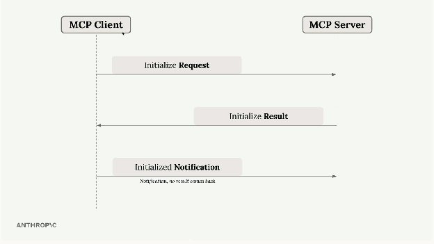

```
1. Initialize Request       →  Client sends this first
2. Initialize Result         ←  Server responds with capabilities
3. Initialized Notification  →  Client confirms (no response expected)
```

Only after this handshake can you send other requests like tool calls or prompt listings.

### Message Types and Flow

MCP supports various message types that flow in both directions:

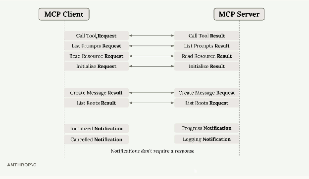

The key insight is that some messages require responses (requests → results) while others don't (notifications). Both client and server can initiate communication at any time.

### Four Communication Patterns

With any transport, you need to handle four communication scenarios:

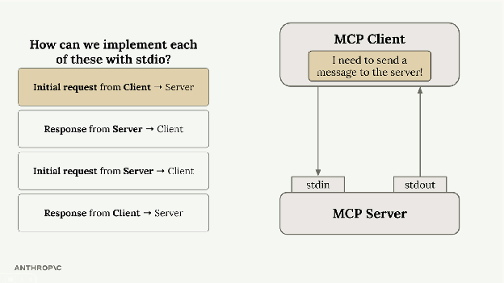

| Direction | Type | Channel |
|---|---|---|
| Client → Server | Request | Client writes to stdin |
| Server → Client | Response | Server writes to stdout |
| Server → Client | Request | Server writes to stdout |
| Client → Server | Response | Client writes to stdin |

The beauty of stdio is its simplicity — either party can initiate communication at any time using these two channels. This represents the "ideal" case where bidirectional communication is seamless.

### Why This Matters

Understanding stdio transport is crucial because it represents the **baseline** for understanding what full MCP communication looks like. When we move to other transports like HTTP, we encounter limitations where the server cannot always initiate requests to the client.

For development and testing, stdio transport is perfect. For production deployments where client and server need to run on different machines, you'll need to consider other transport options with their own trade-offs.

---

## The StreamableHTTP Transport

The StreamableHTTP transport enables MCP clients to connect to remotely hosted servers over HTTP. Unlike stdio (same machine), this opens up possibilities for public MCP servers accessible to anyone.

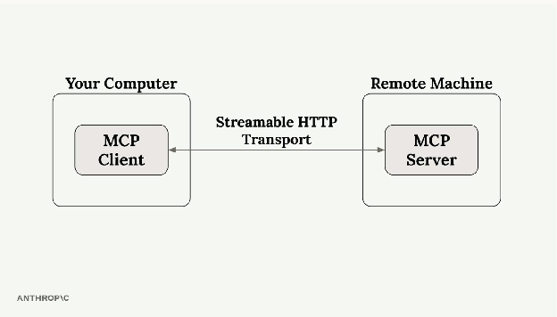

However, there's an important caveat: some configuration settings can significantly limit your MCP server's functionality. If your application works perfectly with stdio transport locally but breaks when deployed with HTTP transport, this is likely the culprit.

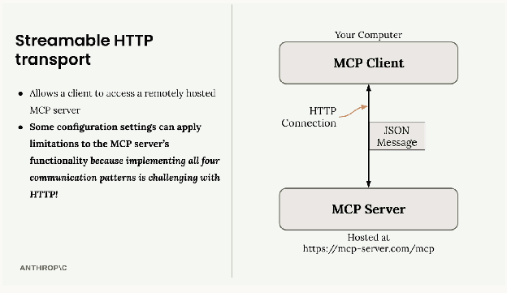

### The HTTP Communication Challenge

```
Clients CAN easily:       →  Send requests to servers (server has a known URL)
Servers CAN easily:       ←  Respond to client requests
Servers CANNOT easily:    →  Initiate requests to clients (clients don't have known URLs)
```

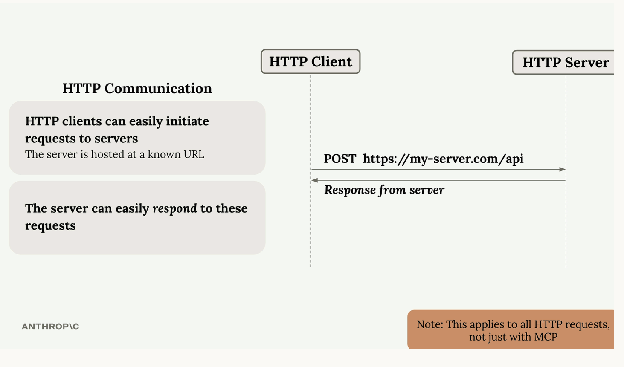

In standard HTTP:
- Clients can easily initiate requests to servers (the server has a known URL)
- Servers can easily respond to these requests
- Servers **cannot** easily initiate requests to clients (clients don't have known URLs)
- Response patterns from client back to server become problematic

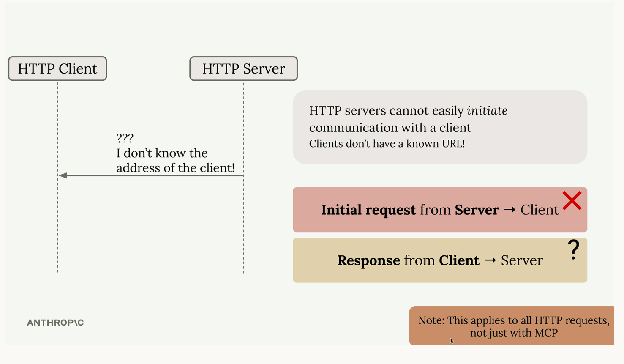

### MCP Features Affected by HTTP Limitations

This HTTP limitation impacts specific MCP communication patterns. The following message types become difficult to implement with plain HTTP:

| Feature | Requires | Status with `stateless_http=True` |
|---|---|---|
| Sampling | Server → Client request | Broken |
| Progress notifications | Server → Client message | Broken |
| Logging messages | Server → Client message | Broken |
| Initialized notifications | Server → Client message | Broken |
| Resource subscriptions | Server → Client message | Broken |

These are exactly the features that break when you enable the restrictive HTTP settings. Progress bars disappear, logging stops working, and server-initiated sampling requests fail.

### The Streamable HTTP Solution

The StreamableHTTP transport does provide a clever solution to work around HTTP's limitations, but it comes with trade-offs. When you're forced to use `stateless_http=True` or `json_response=True`, you're essentially telling the transport to operate within HTTP's constraints rather than working around them.

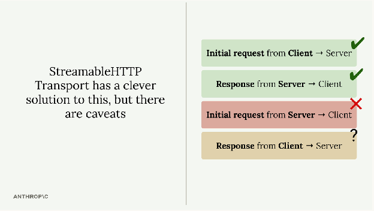

Understanding these limitations helps you make informed decisions about:
- Which transport to use for different deployment scenarios
- How to design your MCP server to gracefully handle HTTP constraints
- When to accept reduced functionality for the benefits of remote hosting

The key is knowing that these restrictions exist and planning your MCP server architecture accordingly. If your application heavily relies on server-initiated requests or real-time notifications, you may need to reconsider your transport choice or implement alternative communication patterns.

### Configuration Settings That Matter

Two key settings control StreamableHTTP behavior:

| Setting | Default | Effect when `True` |
|---|---|---|
| `stateless_http` | `False` | No session tracking, no server-to-client requests |
| `json_response` | `False` | Disables streaming; only returns final JSON result |

When enabled, these settings break core functionality like progress notifications, logging, and server-initiated requests.

### Server-Side Implementation

```python
from mcp.server.fastmcp import FastMCP, Context
from starlette.requests import Request
from starlette.responses import Response

mcp = FastMCP(
    "mcp-server",
    stateless_http=True,
    json_response=True,
)


@mcp.tool()
async def add(a: int, b: int, ctx: Context) -> int:
    await ctx.info("Preparing to add...")
    await asyncio.sleep(2)
    await ctx.report_progress(80, 100)
    return a + b


# Serve a demo HTML page
@mcp.custom_route("/", methods=["GET"])
async def get(request: Request) -> Response:
    with open("index.html", "r") as f:
        html_content = f.read()
    return Response(content=html_content, media_type="text/html")


mcp.run(transport="streamable-http")
```

Note: With `stateless_http=True` and `json_response=True`, the `ctx.info()` and `ctx.report_progress()` calls in the `add` tool will **silently fail** — the client never receives them.

---

## StreamableHTTP In Depth

StreamableHTTP is MCP's solution to a fundamental problem: some MCP functionality requires the server to make requests to the client, but HTTP makes this challenging. Let's explore how StreamableHTTP works around this limitation and when you might need to break that workaround.

### The Core Problem

Some MCP features like sampling, notifications, and logging rely on the server initiating requests to the client. However, HTTP is designed for clients to make requests to servers, not the other way around. StreamableHTTP solves this with a clever workaround using **Server-Sent Events (SSE)**.

### Initial Connection Setup

The process starts like any MCP connection:

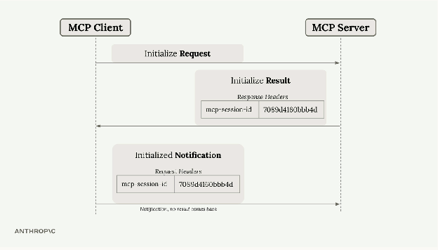

```
1. Client sends Initialize Request (POST)
                   ↓
2. Server responds with Initialize Result + mcp-session-id header
                   ↓
3. Client sends Initialized Notification with session ID
                   ↓
4. Session ID must be included in ALL future requests
```

This session ID is crucial — it uniquely identifies the client and must be included in all future requests.

### The SSE Workaround

After initialization, the client can make a GET request to establish a Server-Sent Events connection. This creates a long-lived HTTP response that the server can use to stream messages back to the client at any time.

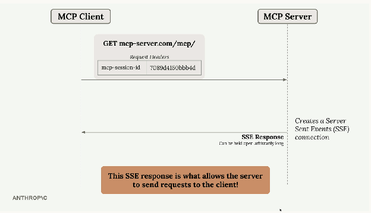

This SSE connection is the key to allowing server-to-client communication. The server can now send requests, notifications, and other messages through this persistent channel.

### Tool Calls and Dual SSE Connections

When the client makes a tool call, things get more complex. The system creates **two separate SSE connections**:

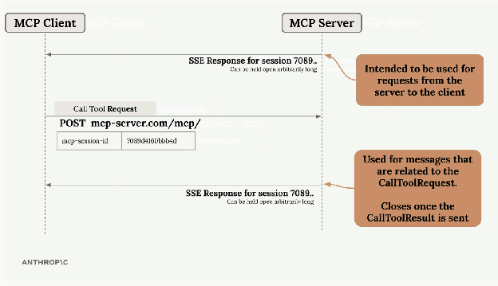

| Connection | Purpose | Lifetime |
|---|---|---|
| **Primary SSE** (GET request) | Server-initiated requests and notifications | Stays open indefinitely |
| **Tool-specific SSE** (POST response) | Tool results, logging messages | Closes after tool result is sent |

### Message Routing

Different types of messages get routed through different connections:

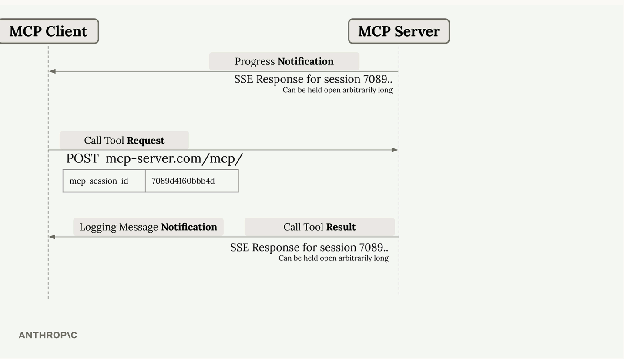

```
Progress notifications   → Through primary SSE connection
Logging messages         → Through tool-specific SSE connection
Tool results             → Through tool-specific SSE connection
Server-initiated requests → Through primary SSE connection
```

### Configuration Flags That Break the Workaround

StreamableHTTP includes two important configuration options:
- `stateless_http`
- `json_response`

Setting these to `True` can break the SSE workaround mechanism. You might want to enable these flags in certain scenarios, but doing so limits the full MCP functionality that depends on server-to-client communication.

### Key Takeaways

StreamableHTTP is more complex than other MCP transports because it has to work around HTTP's limitations. The SSE-based workaround enables full MCP functionality over HTTP, but understanding the dual-connection model is crucial for debugging and optimization.

When building MCP applications with StreamableHTTP, remember that session IDs are required for all requests after initialization, and the system automatically manages multiple SSE connections to handle different types of server-to-client communication.

### How the Demo Works

The `index.html` file implements an interactive browser-based demo that:

1. **Card 1: Initialize Request** — Sends a POST with `method: "initialize"`, captures the `mcp-session-id` from response headers
2. **Card 2: Initialized Notification** — Sends `notifications/initialized` with the session ID (receives HTTP 202)
3. **Card 3: Tool Call** — Calls `tools/call` with `add(5, 3)`, includes `progressToken` in `_meta`
4. **Card 4: Custom Request** — Editable JSON for experimenting with other methods like `tools/list`
5. **SSE Panel** — Opens a GET SSE connection to monitor server-initiated events

---

## State and the StreamableHTTP Transport

The `stateless_http` and `json_response` flags in MCP servers control fundamental aspects of how your server behaves. Understanding when and why to use them is crucial, especially if you're planning to scale your server or deploy it in production.

### When You Need Stateless HTTP

Imagine you build an MCP server that becomes popular. Initially, you might have just a few clients connecting to a single server instance:

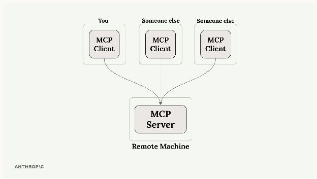

As your server grows, you might have thousands of clients trying to connect. Running a single server instance won't scale to handle all that traffic:

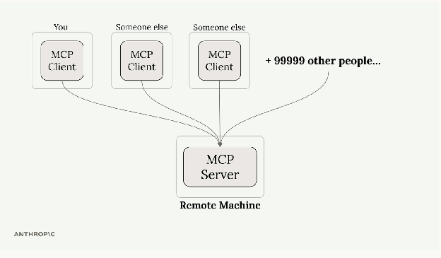

The typical solution is **horizontal scaling** — running multiple server instances behind a load balancer:

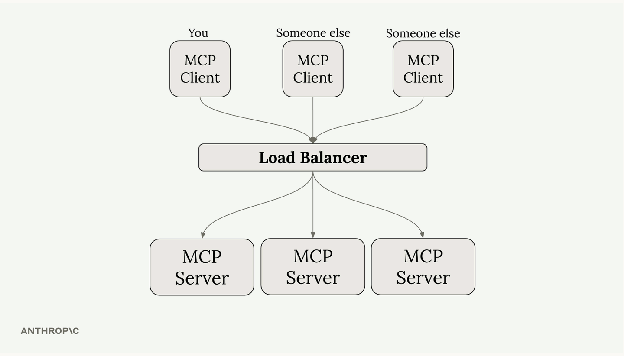

But here's where things get complicated. Remember that MCP clients need **two separate connections**:
- A GET SSE connection for receiving server-to-client requests
- POST requests for calling tools and receiving responses

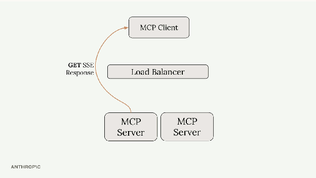

With a load balancer, these requests might get routed to **different** server instances. If your tool needs to use Claude (through sampling), the server handling the POST request would need to coordinate with the server handling the GET SSE connection. This creates a complex coordination problem between servers.

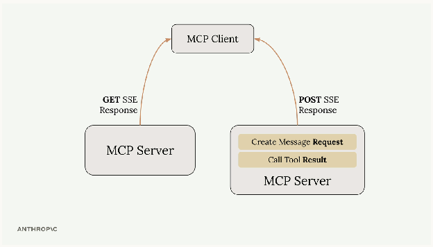

### How Stateless HTTP Solves This

Setting `stateless_http=True` eliminates the coordination problem:

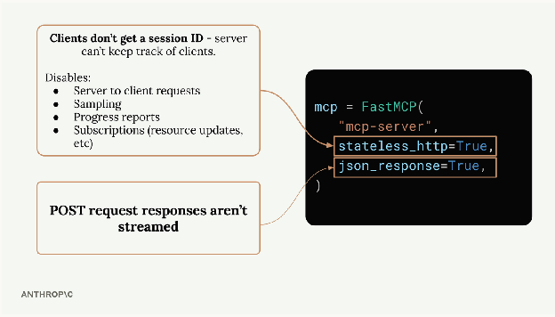

**Enabled:**
- Clients don't get session IDs — the server can't track individual clients
- No server-to-client requests — the GET SSE pathway becomes unavailable
- No sampling — can't use Claude or other AI models
- No progress reports — can't send progress updates during long operations
- No subscriptions — can't notify clients about resource updates
- **But:** Client initialization is no longer required — clients can make requests directly

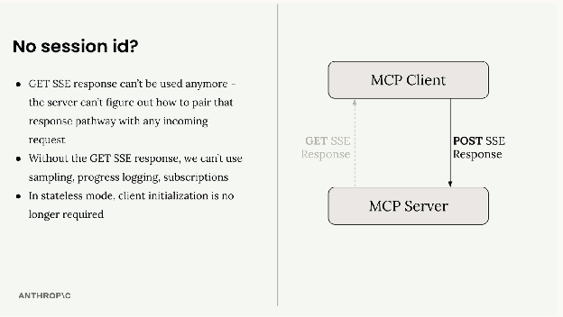

**Disabled (default):**
- Full MCP functionality
- Requires sticky sessions or single-server deployment
- Session-based communication

### Understanding `json_response`

`json_response=True` is simpler — it just disables streaming for POST request responses. Instead of getting multiple SSE messages as a tool executes, you get only the final result as plain JSON.

With streaming disabled:
- No intermediate progress messages
- No log statements during execution
- Just the final tool result

| Setting | Response Format | Intermediate Messages |
|---|---|---|
| `json_response=False` (default) | SSE stream | Progress, logs, then final result |
| `json_response=True` | Plain JSON | Only the final tool result |

### When to Use These Flags

**Use `stateless_http=True` when:**
- You need horizontal scaling with load balancers
- You don't need server-to-client communication
- Your tools don't require AI model sampling
- You want to minimize connection overhead

**Use `json_response=True` when:**
- You don't need streaming responses
- You prefer simpler, non-streaming HTTP responses
- You're integrating with systems that expect plain JSON

These flags fundamentally change how your MCP server operates, so choose them based on your specific scaling and functionality requirements.

### Development vs Production

If you're developing locally with stdio transport but planning to deploy with HTTP transport, **test with the same transport you'll use in production**. The behavior differences between stateful and stateless modes can be significant — catch issues during development, not after deployment.

---

## Complete Code Reference

### Sampling — `server.py`

```python
from mcp.server.fastmcp import FastMCP, Context
from mcp.types import SamplingMessage, TextContent

mcp = FastMCP(name="Demo Server")


@mcp.tool()
async def summarize(text_to_summarize: str, ctx: Context):
    prompt = f"""
        Please summarize the following text:
        {text_to_summarize}
    """

    result = await ctx.session.create_message(
        messages=[
            SamplingMessage(
                role="user", content=TextContent(type="text", text=prompt)
            )
        ],
        max_tokens=4000,
        system_prompt="You are a helpful research assistant.",
    )

    if result.content.type == "text":
        return result.content.text
    else:
        raise ValueError("Sampling failed")


if __name__ == "__main__":
    mcp.run(transport="stdio")
```

### Sampling — `client.py`

```python
from anthropic import AsyncAnthropic
from mcp import ClientSession, StdioServerParameters
from mcp.client.stdio import stdio_client
from mcp.client.session import RequestContext
from mcp.types import (
    CreateMessageRequestParams,
    CreateMessageResult,
    TextContent,
    SamplingMessage,
)

anthropic_client = AsyncAnthropic()
model = "claude-sonnet-4-0"

server_params = StdioServerParameters(
    command="uv",
    args=["run", "server.py"],
)


async def chat(input_messages: list[SamplingMessage], max_tokens=4000):
    messages = []
    for msg in input_messages:
        if msg.role == "user" and msg.content.type == "text":
            messages.append({"role": "user", "content": msg.content.text})
        elif msg.role == "assistant" and msg.content.type == "text":
            messages.append({"role": "assistant", "content": msg.content.text})

    response = await anthropic_client.messages.create(
        model=model,
        messages=messages,
        max_tokens=max_tokens,
    )
    return "".join([p.text for p in response.content if p.type == "text"])


async def sampling_callback(
    context: RequestContext, params: CreateMessageRequestParams
):
    text = await chat(params.messages)
    return CreateMessageResult(
        role="assistant",
        model=model,
        content=TextContent(type="text", text=text),
    )


async def run():
    async with stdio_client(server_params) as (read, write):
        async with ClientSession(
            read, write, sampling_callback=sampling_callback
        ) as session:
            await session.initialize()

            result = await session.call_tool(
                name="summarize",
                arguments={"text_to_summarize": "lots of text"},
            )
            print(result.content)


if __name__ == "__main__":
    import asyncio
    asyncio.run(run())
```

### Notifications — `server.py`

```python
from mcp.server.fastmcp import FastMCP, Context
import asyncio

mcp = FastMCP(name="Demo Server")


@mcp.tool()
async def add(a: int, b: int, ctx: Context) -> int:
    await ctx.info("Preparing to add...")
    await ctx.report_progress(20, 100)

    await asyncio.sleep(2)

    await ctx.info("OK, adding...")
    await ctx.report_progress(80, 100)

    return a + b


if __name__ == "__main__":
    mcp.run(transport="stdio")
```

### Notifications — `client.py`

```python
from mcp import ClientSession, StdioServerParameters
from mcp.client.stdio import stdio_client
from mcp.types import LoggingMessageNotificationParams

server_params = StdioServerParameters(
    command="uv",
    args=["run", "server.py"],
)


async def logging_callback(params: LoggingMessageNotificationParams):
    print(params.data)


async def print_progress_callback(
    progress: float, total: float | None, message: str | None
):
    if total is not None:
        percentage = (progress / total) * 100
        print(f"Progress: {progress}/{total} ({percentage:.1f}%)")
    else:
        print(f"Progress: {progress}")


async def run():
    async with stdio_client(server_params) as (read, write):
        async with ClientSession(
            read, write, logging_callback=logging_callback
        ) as session:
            await session.initialize()

            await session.call_tool(
                name="add",
                arguments={"a": 1, "b": 3},
                progress_callback=print_progress_callback,
            )


if __name__ == "__main__":
    import asyncio
    asyncio.run(run())
```

### Roots — `main.py` (MCP Server)

```python
from pathlib import Path
from mcp.server.fastmcp import FastMCP, Context
from pydantic import Field
from core.video_converter import VideoConverter
from core.utils import file_url_to_path

mcp = FastMCP("VidsMCP", log_level="ERROR")


async def is_path_allowed(requested_path: Path, ctx: Context) -> bool:
    roots_result = await ctx.session.list_roots()
    client_roots = roots_result.roots

    if not requested_path.exists():
        return False

    if requested_path.is_file():
        requested_path = requested_path.parent

    for root in client_roots:
        root_path = file_url_to_path(root.uri)
        try:
            requested_path.relative_to(root_path)
            return True
        except ValueError:
            continue

    return False


@mcp.tool()
async def convert_video(
    input_path: str = Field(description="Path to the input MP4 file"),
    format: str = Field(description="Output format (e.g. 'mov')"),
    *,
    ctx: Context,
):
    """Convert an MP4 video file to another format using ffmpeg"""
    input_file = VideoConverter.validate_input(input_path)

    if not await is_path_allowed(input_file, ctx):
        raise ValueError(f"Access to path is not allowed: {input_path}")

    return await VideoConverter.convert(input_path, format)


@mcp.tool()
async def list_roots(ctx: Context):
    """List all directories accessible to this server."""
    roots_result = await ctx.session.list_roots()
    return [file_url_to_path(root.uri) for root in roots_result.roots]


@mcp.tool()
async def read_dir(
    path: str = Field(description="Path to a directory to read"),
    *,
    ctx: Context,
):
    """Read directory contents. Path must be within one of the client's roots."""
    requested_path = Path(path).resolve()

    if not await is_path_allowed(requested_path, ctx):
        raise ValueError("Error: can only read directories within a root")

    return [entry.name for entry in requested_path.iterdir()]


if __name__ == "__main__":
    mcp.run(transport="stdio")
```

### Roots — `mcp_client.py` (Client with Roots)

```python
from typing import Optional, Any
from contextlib import AsyncExitStack
from mcp import ClientSession, StdioServerParameters, types
from mcp.client.stdio import stdio_client
from mcp.types import Root, ListRootsResult, ErrorData
from mcp.shared.context import RequestContext
from pathlib import Path
from pydantic import FileUrl
import json
from pydantic import AnyUrl


class MCPClient:
    def __init__(
        self,
        command: str,
        args: list[str],
        env: Optional[dict] = None,
        roots: Optional[list[str]] = None,
    ):
        self._command = command
        self._args = args
        self._env = env
        self._roots = self._create_roots(roots) if roots else []
        self._session: Optional[ClientSession] = None
        self._exit_stack: AsyncExitStack = AsyncExitStack()

    def _create_roots(self, root_paths: list[str]) -> list[Root]:
        """Convert path strings to Root objects."""
        roots = []
        for path in root_paths:
            p = Path(path).resolve()
            file_url = FileUrl(f"file://{p}")
            roots.append(Root(uri=file_url, name=p.name or "Root"))
        return roots

    async def _handle_list_roots(
        self, context: RequestContext["ClientSession", None]
    ) -> ListRootsResult | ErrorData:
        """Callback for when server requests roots."""
        return ListRootsResult(roots=self._roots)

    async def connect(self):
        server_params = StdioServerParameters(
            command=self._command,
            args=self._args,
            env=self._env,
        )
        stdio_transport = await self._exit_stack.enter_async_context(
            stdio_client(server_params)
        )
        _stdio, _write = stdio_transport
        self._session = await self._exit_stack.enter_async_context(
            ClientSession(
                _stdio,
                _write,
                list_roots_callback=self._handle_list_roots
                if self._roots
                else None,
            )
        )
        await self._session.initialize()

    def session(self) -> ClientSession:
        if self._session is None:
            raise ConnectionError(
                "Client session not initialized. Call connect first."
            )
        return self._session

    async def list_tools(self) -> list[types.Tool]:
        result = await self.session().list_tools()
        return result.tools

    async def call_tool(self, tool_name: str, tool_input):
        return await self.session().call_tool(tool_name, tool_input)

    async def cleanup(self):
        await self._exit_stack.aclose()
        self._session = None

    async def __aenter__(self):
        await self.connect()
        return self

    async def __aexit__(self, exc_type, exc_val, exc_tb):
        await self.cleanup()
```

### Roots — `mcp_server.py` (Entry Point)

```python
import asyncio
import sys
import os
from dotenv import load_dotenv
from contextlib import AsyncExitStack

from mcp_client import MCPClient
from core.claude import Claude
from core.cli_chat import CliChat
from core.cli import CliApp

load_dotenv()

claude_model = os.getenv("CLAUDE_MODEL", "claude-sonnet-4-0")
anthropic_api_key = os.getenv("ANTHROPIC_API_KEY", "")


async def main():
    claude_service = Claude(model=claude_model)

    # Get root directories from command line arguments
    root_paths = sys.argv[1:]
    if not root_paths:
        print("Usage: uv run main.py <root1> [root2] ...")
        sys.exit(1)

    clients = {}

    async with AsyncExitStack() as stack:
        doc_client = await stack.enter_async_context(
            MCPClient(
                command="uv", args=["run", "mcp_server.py"], roots=root_paths
            )
        )
        clients["doc_client"] = doc_client

        chat = CliChat(
            doc_client=doc_client,
            clients=clients,
            claude_service=claude_service,
        )

        cli = CliApp(chat)
        await cli.initialize()
        await cli.run()


if __name__ == "__main__":
    if sys.platform == "win32":
        asyncio.set_event_loop_policy(asyncio.WindowsProactorEventLoopPolicy())
    asyncio.run(main())
```

### Roots — `core/video_converter.py`

```python
import os
import asyncio
from pathlib import Path


class VideoConverter:
    QUALITY_PRESETS = {
        "low": {"crf": "28", "preset": "fast"},
        "medium": {"crf": "23", "preset": "medium"},
        "high": {"crf": "18", "preset": "slow"},
    }

    SUPPORTED_FORMATS = ["webm", "mkv", "avi", "mov", "gif"]

    @classmethod
    def validate_input(cls, input_path: str) -> Path:
        input_file = Path(input_path)
        if not input_file.exists():
            raise ValueError(f"Input file not found: {input_path}")
        if not input_path.lower().endswith(".mp4"):
            raise ValueError("Input file must be an MP4 file")
        return input_file

    @classmethod
    def generate_output_path(cls, input_path: str, format: str) -> str:
        base_path = os.path.splitext(input_path)[0]
        return f"{base_path}.{format.lower()}"

    @classmethod
    def build_ffmpeg_command(cls, input_path: str, output_path: str, format: str) -> list:
        preset = cls.QUALITY_PRESETS["medium"]
        cmd = ["ffmpeg", "-i", input_path, "-y"]

        if format.lower() == "gif":
            cmd.extend([
                "-vf", "fps=15,scale=480:-1:flags=lanczos",
                "-c:v", "gif",
                output_path,
            ])
        elif format.lower() in cls.SUPPORTED_FORMATS:
            cmd.extend([
                "-c:v", "libx264",
                "-preset", preset["preset"],
                "-crf", preset["crf"],
                "-c:a", "aac",
                "-b:a", "128k",
                output_path,
            ])
        else:
            raise ValueError(f"Unsupported output format: {format}")

        return cmd

    @classmethod
    async def convert(cls, input_path: str, format: str) -> str:
        cls.validate_input(input_path)
        output_path = cls.generate_output_path(input_path, format)
        cmd = cls.build_ffmpeg_command(input_path, output_path, format)

        try:
            process = await asyncio.create_subprocess_exec(
                *cmd,
                stdout=asyncio.subprocess.PIPE,
                stderr=asyncio.subprocess.PIPE,
            )
            _, stderr = await process.communicate()

            if process.returncode != 0:
                raise RuntimeError(f"FFmpeg conversion failed: {stderr.decode()}")

            return f"Successfully converted {input_path} to {output_path}"
        except FileNotFoundError:
            raise RuntimeError("FFmpeg not found. Please install ffmpeg.")
```

### Roots — `core/utils.py`

```python
from pathlib import Path
from urllib.parse import unquote, urlparse


def file_url_to_path(file_url) -> Path:
    """Convert a file:// URL to a Path object."""
    url_str = str(file_url)
    parsed = urlparse(url_str)
    path = unquote(parsed.path)
    # Handle Windows paths: /C:/... → C:/...
    if len(path) > 2 and path[0] == "/" and path[2] == ":":
        path = path[1:]
    return Path(path)
```

### Transport-HTTP — `main.py`

```python
import asyncio
from starlette.requests import Request
from starlette.responses import Response
from mcp.server.fastmcp import FastMCP, Context


mcp = FastMCP(
    "mcp-server",
    stateless_http=True,
    json_response=True,
)


@mcp.tool()
async def add(a: int, b: int, ctx: Context) -> int:
    await ctx.info("Preparing to add...")
    await asyncio.sleep(2)
    await ctx.report_progress(80, 100)
    return a + b


@mcp.custom_route("/", methods=["GET"])
async def get(request: Request) -> Response:
    with open("index.html", "r") as f:
        html_content = f.read()
    return Response(content=html_content, media_type="text/html")


mcp.run(transport="streamable-http")
```

---

## Key Takeaways

1. **Sampling shifts LLM costs to the client** — Servers request text generation through the client instead of calling Claude directly. Essential for public servers where you can't absorb every user's AI costs.

2. **Notifications improve UX for long-running tools** — `ctx.info()` for logging and `ctx.report_progress()` for progress updates give users real-time feedback instead of silent waits.

3. **Roots provide both convenience and security** — They let users reference files by name (not full path) while restricting server access to approved directories. Implement `is_path_allowed()` checks in all file-accessing tools.

4. **MCP is bidirectional** — Both clients and servers can initiate communication. This is fundamental to understanding why some features break under certain transport configurations.

5. **STDIO is the ideal transport** — Full bidirectional communication, simple setup, perfect for development. Use it as the baseline for understanding what complete MCP communication looks like.

6. **StreamableHTTP uses SSE to work around HTTP limitations** — Dual connections (primary GET SSE + tool-specific POST SSE) enable server-to-client communication. Setting `stateless_http=True` or `json_response=True` breaks this workaround.

7. **Stateless HTTP enables horizontal scaling at a cost** — You gain load balancer compatibility but lose sampling, progress notifications, logging, and subscriptions. Choose based on your scaling and functionality requirements.

8. **Test with your production transport** — Behavior differs significantly between stdio and HTTP, and between stateful and stateless modes. Always test with the transport configuration you'll deploy with.
